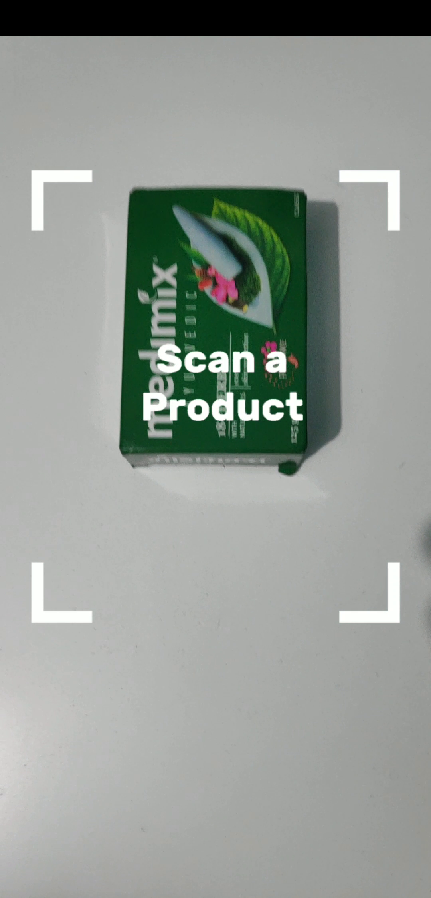
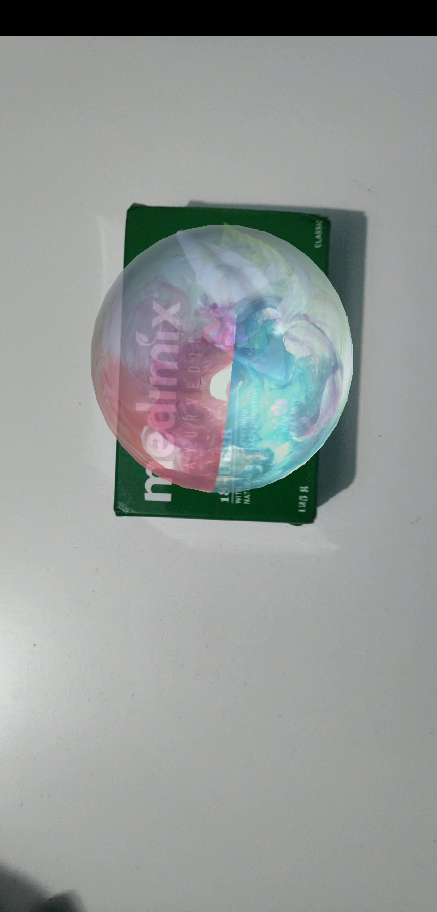
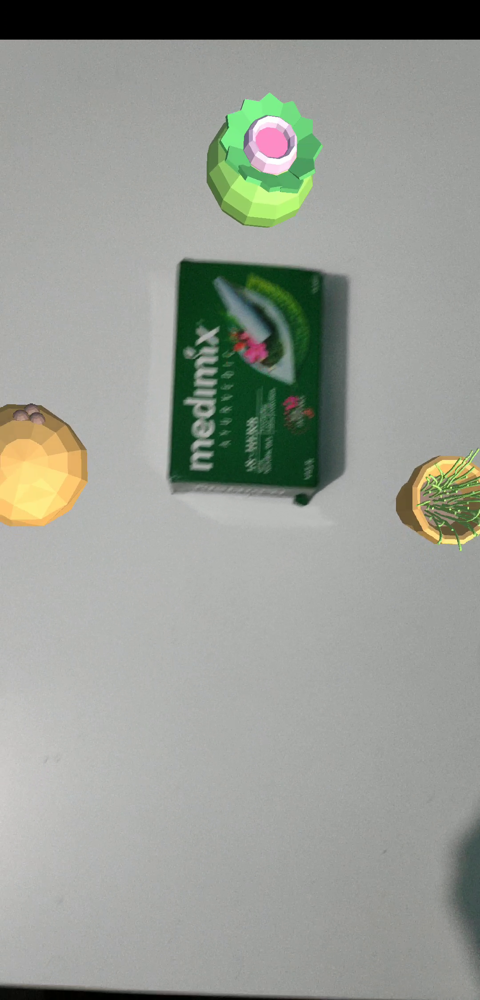
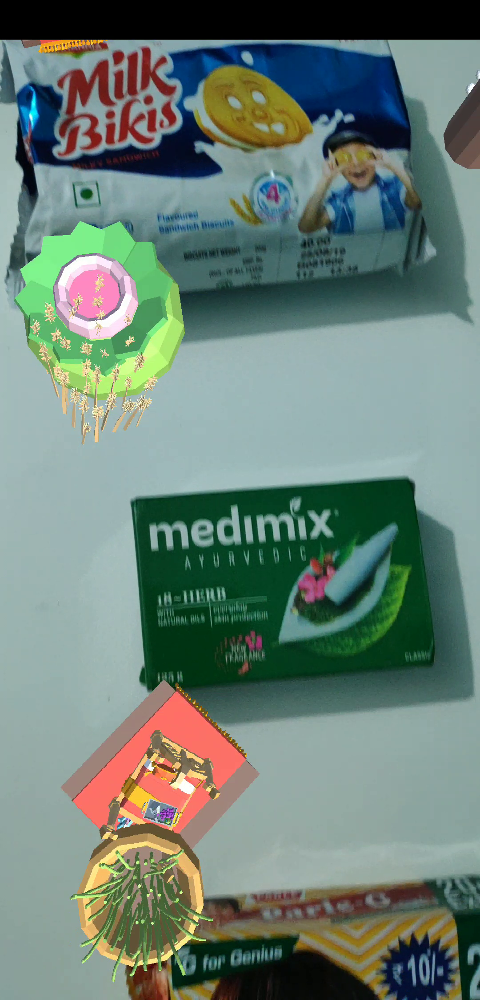
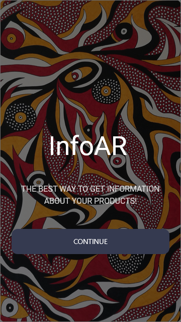
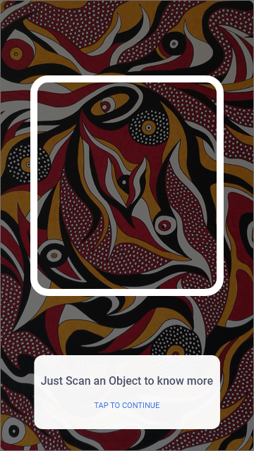
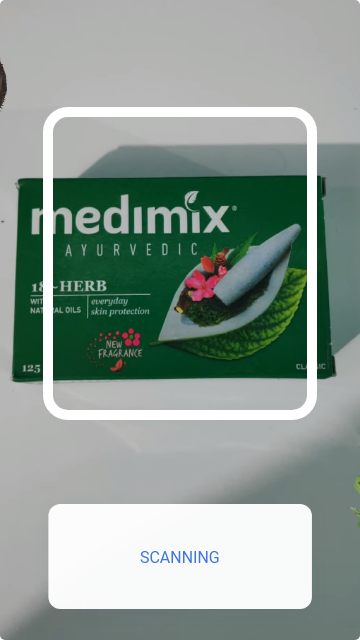
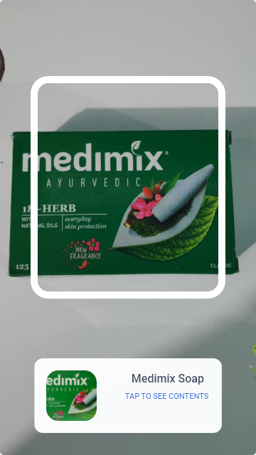
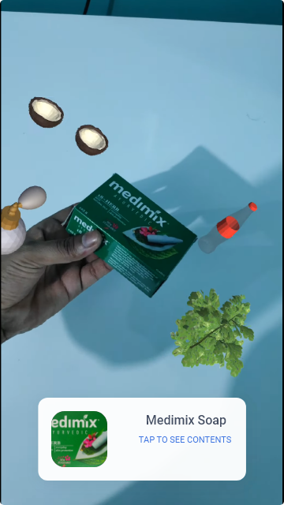

# InfoAR
An Augmented Reality App which you can use to scan a product and get product information.
This application allows you to scan products and get relevant information/instruction/advertisement in augmented reality for your product.  
Check out a quick video demo [here](https://youtu.be/GJhGjtjPExk).

# How to use?
1. You can upload details of your product through [here](http://geekyjock.me/InfoAR-AddProduct/). 
   To see how this form works, checkout [InfoAR-AddProduct](https://github.com/geekyJock8/InfoAR-AddProduct).
1. Once you've uploaded the details(Name, Images, Details) of your product. 
   You can either build the application or download the latest build from [here](https://drive.google.com/file/d/11VXJ75b7uzTbT1_Pan313OruAZMLv7vC/view?usp=sharing).
1. Then just scan the your product in real world and you will see the results.

**Note**: *The UI is designed only for 1920X1080 resoultion. So, if you use a phone with different resolution, you'll probably see some weird results*. 

# How to Build?
This application used Unity *2018.4.4f1*. So, Make sure that you are not using an older version. 
The project is set to be built for Android but you can also build it for iOS with correct settings. 
It uses *ARCore Unity SDK v1.11*.

# Screenshots
Following are some screenshots taken from the latest version.
and the next step is to implement these UI features.

  

  
  
  
  

   
  

  
  
  

# Mockup
Following are the app mockups which I designed in Adobe XD before starting with the development. All of these UI features are not implemented yet
and the next step is to implement these UI features.

  

  
  
  
  

   
  

  
  
  
  

# Contribute
Feel free to raise an [issue](https://github.com/geekyJock8/InfoAR/issues) or a [PR](https://github.com/geekyJock8/InfoAR/pulls)!
